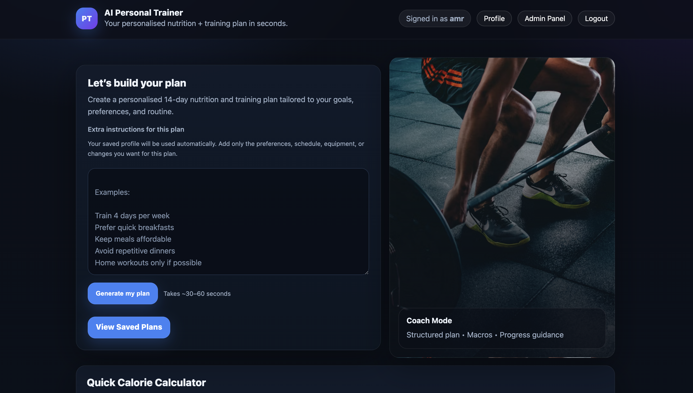
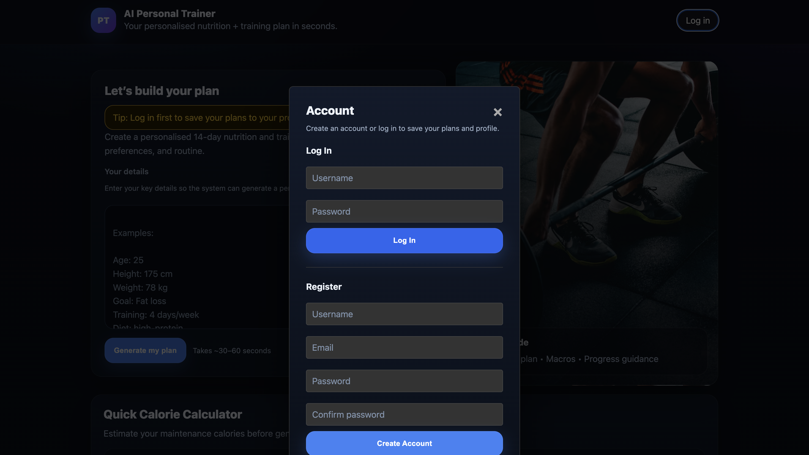
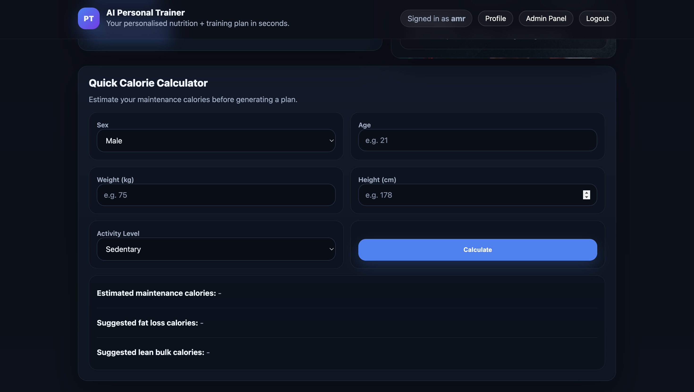
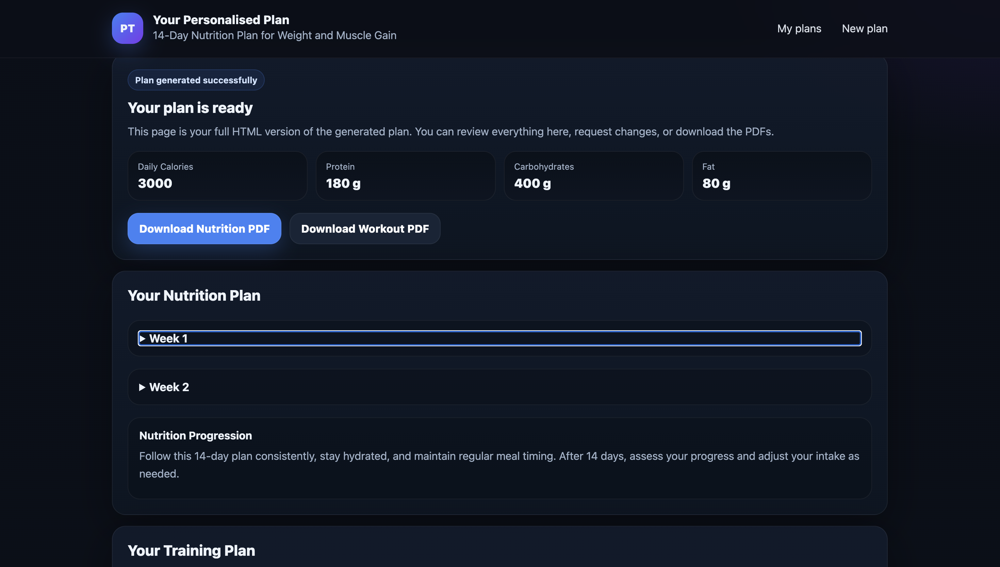
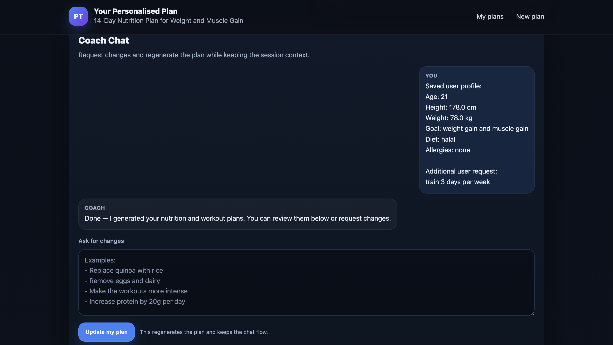

# 🥗 AI-Powered Personalised Fitness & Nutrition Planner

An AI-powered web application that generates personalised **14-day fitness and nutrition plans** based on a user's health profile, dietary preferences, allergies, and fitness goals.

The application integrates a Large Language Model (LLM) through the OpenRouter API to produce structured workout and meal plans while validating nutritional consistency and supporting interactive plan refinement.

---

## 🚀 Features

- User registration and profile management
- AI-generated 14-day nutrition and workout plans
- Personalised recommendations based on:
  - Age
  - Height & Weight
  - Fitness Goals
  - Dietary Preferences
  - Allergies
- Nutritional validation for calories and macronutrients
- Chat-based AI plan refinement
- Plan version history
- PDF export for nutrition and workout plans
- Structured JSON generation with validation and error handling

---

## 🛠️ Tech Stack

| Category | Technologies |
|----------|--------------|
| Backend | Python, Flask |
| AI Integration | OpenRouter API (LLM) |
| Database | SQLite |
| PDF Generation | ReportLab |
| Frontend | HTML, CSS |
| Version Control | Git, GitHub |

---

## 📷 Application Preview

### Home Page



---

### Account Login & Registration



---

### Quick Calorie Calculator



---

### Generated 14-Day Plan



---

### Coach Chat & Plan Refinement



---

## ⚙️ Installation

### 1. Clone the repository

```bash
git clone https://github.com/amrelbassiounii/ai-fitness-nutrition-planner.git
```

### 2. Navigate to the project directory

```bash
cd ai-fitness-nutrition-planner
```

### 3. Install the required dependencies

```bash
pip install -r requirements.txt
```

### 4. Create a `.env` file

Add your OpenRouter API key:

```text
OPENROUTER_API_KEY=your_api_key_here
```

### 5. Run the application

```bash
python app.py
```

### 6. Open your browser

```
http://127.0.0.1:5000
```

---

## 📂 Project Structure

```text
AI-Nutrition-Planner/
│
├── app.py
├── ai_logic.py
├── database.py
├── requirements.txt
├── templates/
├── static/
├── outputs/
└── README.md
```

---

## 🔒 Security

- API keys are stored using environment variables.
- Database files are excluded from the repository.
- Generated plans are validated before being presented to the user.
- Error handling is implemented to improve reliability when interacting with the LLM.

---

## 💡 Future Improvements

- OAuth authentication
- Progress tracking dashboard
- Mobile-responsive interface
- Integration with wearable fitness devices
- AI-generated grocery lists
- PostgreSQL cloud database support

---

## 👨‍💻 Author

**Amr Elbassiouni**

BSc Computer Science (Artificial Intelligence)

University of the West of England

---

## 📄 License

This project was developed as a final-year university project and is shared for educational and portfolio purposes.